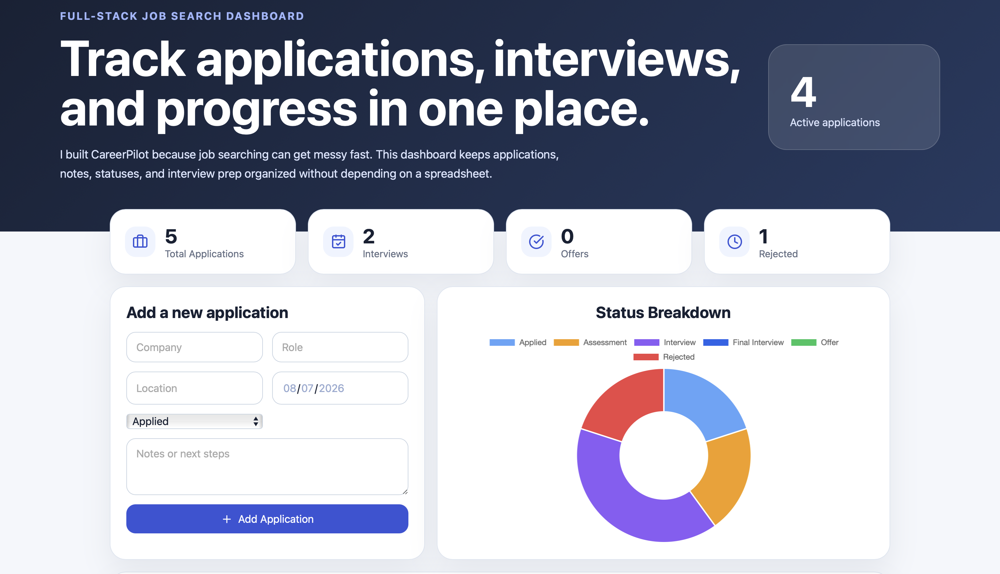
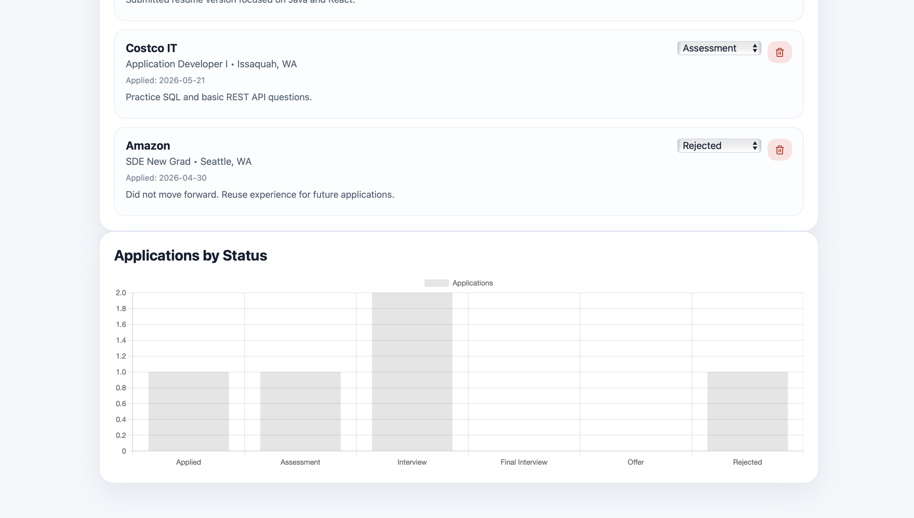

# CareerPilot

A full-stack job application tracking platform built with **React**, **Spring Boot**, and **REST APIs** to help organize applications, interview progress, notes, and job-search analytics.

**Built by Merra Migora**

---

## Overview

CareerPilot was created to solve a common problem during the job search process: keeping track of dozens of applications, interview stages, notes, and follow-up tasks.

Instead of managing everything through spreadsheets, emails, and sticky notes, CareerPilot provides a centralized dashboard where users can organize their job search and monitor their progress through an intuitive interface.

This project demonstrates full-stack software engineering concepts including frontend development, REST API design, database integration, responsive UI design, and clean project organization.

---

# Screenshots

## Dashboard



The dashboard provides an overview of the current job search with application statistics, interview progress, status visualization, and quick actions.

---

## Application Management


Users can create new applications, update their status throughout the hiring process, add personal notes, and manage all applications from one place.

---

## Analytics



Interactive charts summarize application progress and provide a quick visual overview of the current hiring pipeline.

---

# Features

- Track job applications in one place
- Add new applications
- Update application status throughout the hiring process
- Store interview notes
- Monitor application statistics
- Visualize progress using charts
- Delete applications
- Responsive dashboard layout
- REST API backend
- Database-ready architecture

---

# Technology Stack

## Frontend

- React
- Vite
- JavaScript (ES6)
- CSS3
- Chart.js
- React Chart.js 2

## Backend

- Java
- Spring Boot
- Spring Data JPA
- REST API
- H2 Database
- PostgreSQL-ready configuration

## Development Tools

- Git
- GitHub
- Maven
- npm
- IntelliJ IDEA
- VS Code

---

# Architecture

```
                React Frontend
                      │
          HTTP Requests (REST API)
                      │
             Spring Boot Backend
                      │
             Spring Data JPA
                      │
          H2 Database / PostgreSQL
```

The frontend currently uses realistic sample data for demonstration purposes while the backend provides REST endpoints that are ready to be connected as the next development step.

---

# Project Structure

```
CareerPilot
│
├── frontend
│   ├── src
│   ├── public
│   ├── package.json
│   └── vite.config.js
│
├── backend
│   ├── src/main/java
│   ├── src/main/resources
│   ├── pom.xml
│   └── mvnw
│
├── database
│   └── schema.sql
│
├── docs
│   └── screenshots
│
└── README.md
```

---

# API Endpoints

The Spring Boot backend exposes REST endpoints for managing job applications.

| Method | Endpoint | Description |
|---------|----------|-------------|
| GET | `/api/applications` | Retrieve all applications |
| POST | `/api/applications` | Create a new application |
| PUT | `/api/applications/{id}` | Update an existing application |
| DELETE | `/api/applications/{id}` | Delete an application |

---

# Demo Data

The frontend ships with realistic sample applications from companies including:

- Microsoft
- Amazon
- Nordstrom
- Costco IT

This allows the dashboard to demonstrate statistics and analytics immediately after launching the application.

---

# Running the Project

## Frontend

```bash
cd frontend
npm install
npm run dev
```

Open the Vite development server in your browser.

---

## Backend

```bash
cd backend
./mvnw spring-boot:run
```

or

```bash
mvn spring-boot:run
```

The backend runs locally at:

```
http://localhost:8080
```

---

# Future Enhancements

- User authentication
- Resume management
- Cover letter storage
- Interview scheduling
- Calendar integration
- Email reminders
- Search and filtering
- Advanced analytics
- Cloud deployment
- PostgreSQL production database

---

# What I Learned

Building CareerPilot helped strengthen my understanding of full-stack software development by combining frontend development with backend APIs and database design.

Some of the concepts reinforced during this project include:

- Component-based React development
- REST API architecture
- Spring Boot application structure
- Database modeling
- Responsive interface design
- State management
- Chart visualization
- Git version control
- Organizing a scalable project structure

---

# Resume Bullet

> Developed a full-stack job application tracking platform using React, Spring Boot, REST APIs, and SQL, enabling users to organize applications, interview progress, notes, and analytics through a responsive dashboard.

---

## Author

**Merra Migora**

Computer Science Student  
University of Washington Tacoma

GitHub: https://github.com/merramigora
